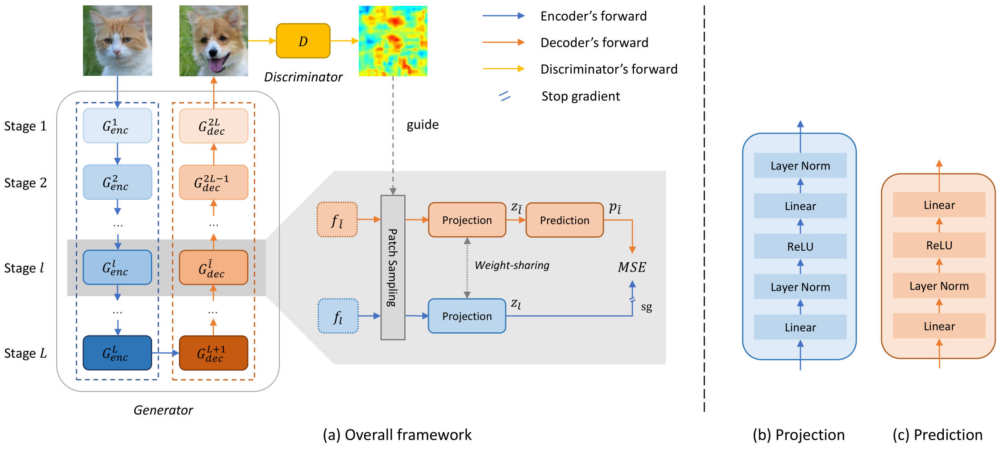
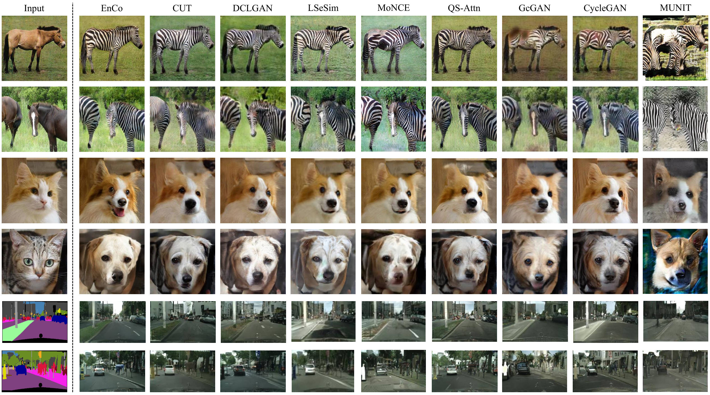

# Rethinking the Paradigm of Content Constraints in Unpaired Image-to-Image Translation

This repository contains the code for the paper _"Rethinking the Paradigm of Content Constraints in Unpaired Image-to-Image Translation"_, AAAI 2024.

_**Abstract** - In an unpaired setting, lacking sufficient content constraints for image-to-image translation (I2I) tasks, GAN-based approaches are usually prone to model collapse. Current solutions can be divided into two categories, reconstruction-based and Siamese network-based. The former requires that the transformed or transforming image can be perfectly converted back to the original image, which is sometimes too strict and limits the generative performance. The latter involves feeding the original and generated images into a feature extractor and then matching their outputs. This is not efficient enough, and a universal feature extractor is not easily available. In this paper, we propose EnCo, a simple but efficient way to maintain the content by constraining the representational similarity in the latent space of patch-level features from the same stage of the **En**coder and de**Co**der of the generator. For the similarity function, we use a simple MSE loss instead of contrastive loss, which is currently widely used in I2I tasks. Benefits from the design, EnCo training is extremely efficient, while the features from the encoder produce a more positive effect on the decoding, leading to more satisfying generations. In addition, we rethink the role played by discriminators in sampling patches and propose a discriminative attention-guided (DAG) patch sampling strategy to replace random sampling. DAG is parameter-free and only requires negligible computational overhead, while significantly improving the performance of the model. Extensive experiments on multiple datasets demonstrate the effectiveness and advantages of EnCo, and we achieve multiple state-of-the-art compared to previous methods._


*Figure 1: (a) The overview of EnCo framework. EnCo constrain the content by agreeing on the representational similarity in the latent space of features from the same stage of the encoder and decoder of the generator. (b) The architecture of the projection. (c) The architecture of the prediction.*

## Evaluation results


*Table 1: Comparison with the state-of-the-art methods on unpaired image translation.*


## Preparing datasets
Download the CUT and CycleGAN datasets using the following script. Some of the datasets are collected by other researchers and papers. Please cite the original papers if you use the data.

```bash
bash ./datasets/download_cut_dataset.sh dataset_name
```

- `grumpifycat`: 88 Russian Blue cats from The Oxford-IIIT Pet [Dataset](http://www.robots.ox.ac.uk/~vgg/data/pets/) and 214 Grumpy cats. We use an OpenCV detector `./datasets/detect_cat_face.py` to detect cat faces.
- `facades`: 400 images from the [CMP Facades dataset](http://cmp.felk.cvut.cz/~tylecr1/facade). [[Citation](../datasets/bibtex/facades.tex)]
- `cityscapes`: 2975 images from the [Cityscapes training set](https://www.cityscapes-dataset.com). [[Citation](../datasets/bibtex/cityscapes.tex)]. Note: Due to license issue, we cannot directly provide the Cityscapes dataset. Please download the Cityscapes dataset from [https://cityscapes-dataset.com](https://cityscapes-dataset.com)  and use the script `./datasets/prepare_cityscapes_dataset.py`.

Please cite the CycleGAN paper if you use the following datasets. [[Citation](../datasets/bibtex/cyclegan.tex)]

- `maps`: 1096 training images scraped from Google Maps.
- `horse2zebra`: 939 horse images and 1177 zebra images downloaded from [ImageNet](http://www.image-net.org) using keywords `wild horse` and `zebra`
- `apple2orange`: 996 apple images and 1020 orange images downloaded from [ImageNet](http://www.image-net.org) using keywords `apple` and `navel orange`.
- `summer2winter_yosemite`: 1273 summer Yosemite images and 854 winter Yosemite images were downloaded using Flickr API. See more details in our paper.
- `monet2photo`, `vangogh2photo`, `ukiyoe2photo`, `cezanne2photo`: The art images were downloaded from [Wikiart](https://www.wikiart.org/). The real photos are downloaded from Flickr using the combination of the tags *landscape* and *landscapephotography*. The training set size of each class is Monet:1074, Cezanne:584, Van Gogh:401, Ukiyo-e:1433, Photographs:6853.
- `iphone2dslr_flower`: both classes of images were downlaoded from Flickr. The training set size of each class is iPhone:1813, DSLR:3316. See more details in our paper.

To train a model on your own datasets, you need to create a data folder with two subdirectories `trainA` and `trainB` that contain images from domain A and B. You can test your model on your training set by setting `--phase train` in `test.py`. You can also create subdirectories `testA` and `testB` if you have test data.

## Training and Test

- Download the `cityscapes` dataset.

```bash
bash ./datasets/download_cut_dataset.sh cityscapes
```

Preprocess the `cityscapes` dataset with the scripts `datasets/prepare_cityscapes_dataset.py`.

```bash
python prepare_cityscapes_dataset.py --gitFine_dir ./gtFine/ --leftImg8bit_dir ./leftImg8bit --output_dir ./datasets/cityscapes/
```

The dataset will be saved at `./datasets/cityscapes/`.

- To view training results and loss plots, run `python -m visdom.server` and click the URL http://localhost:8097.

- Train the EnCo model:

```bash
python train.py --dataroot ./datasets/cityscapes --name CITY_EnCo --model enco --nce_layers 3,7,13,18,24,28 --batch_size 1 --n_epochs 100 --n_epochs_decay 100 --num_threads 0 --lambda_IDT 10 --lambda_NCE 2 --netF mlp_sample_with_DAG --lr_G 5e-5 --lr_F 5e-5 --lr_D 2e-4 --warmup_epochs 20 --flip_equivariance True
```

The checkpoints will be stored at `./checkpoints/CITY_EnCo/web`.

- Test the EnCo model:

```bash
python test.py --dataroot ./datasets/cityscapes --name CITY_EnCo --model enco --phase test
```

The test results will be saved to a html file here: `./results/cityscapes/latest_train/index.html`.

## Citation

If you use our code or our results, please consider citing our paper. Thanks in advance!

```
@article{cai2022constraining,
  title={Constraining Multi-scale Pairwise Features between Encoder and Decoder Using Contrastive Learning for Unpaired Image-to-Image Translation},
  author={Cai, Xiuding and Zhu, Yaoyao and Miao, Dong and Fu, Linjie and Yao, Yu},
  journal={arXiv preprint arXiv:2211.10867},
  year={2022}
}
```

If you use something included in CUT, you may also [CUT](https://arxiv.org/pdf/2007.15651).

```
@inproceedings{park2020cut,
  title={Contrastive Learning for Unpaired Image-to-Image Translation},
  author={Taesung Park and Alexei A. Efros and Richard Zhang and Jun-Yan Zhu},
  booktitle={European Conference on Computer Vision},
  year={2020}
}
```

## Acknowledge

Our code is developed based on [CUT](https://github.com/taesungp/contrastive-unpaired-translation) and [DCLGAN](https://github.com/JunlinHan/DCLGAN). We also thank [pytorch-fid](https://github.com/mseitzer/pytorch-fid) for FID computation, [drn](https://github.com/fyu/drn) for mIoU computation.
